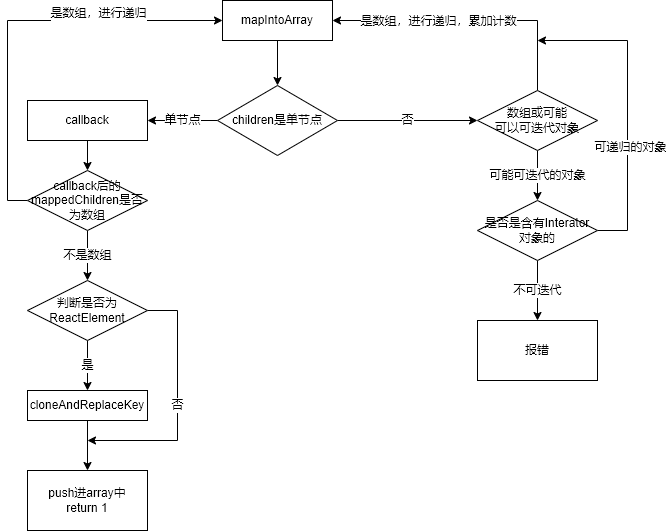

# ReactChildren

## mapIntoArray

 

- 函数的入口

  ``` javascript
    function mapIntoArray(
      children: ?ReactNodeList, // 要遍历的子节点树
      array: Array<React$Node>, // 遍历的结果数组
      escapedPrefix: string, 
      nameSoFar: string, 
      callback: (?React$Node) => ?ReactNodeList, // 给当前遍历节点调用的函数
    ): number { // 返回值是 map 得到的数组的元素数
      ...
    }
  ```

- 判断children是否为单节点
  null、string、number、$$typeof为REACT_ELEMENT_TYPE和REACT_PORTAL_TYPE时被认为是单节点（React 中可以有效渲染的节点类型）

  ``` javascript
  const type = typeof children;

  if (type === 'undefined' || type === 'boolean') {
    // All of the above are perceived as null.
    // children 如果是 undefined 或 boolean，都被视为 null 去处理
    children = null;
  }

  let invokeCallback = false; // 是否直接用单个子节点调用 callback

  // 如果 children 是 null | string | number 
  // 或者是 $$typeof 属性是 REACT_ELEMENT_TYPE 或 REACT_PORTAL_TYPE 的对象
  // 它们都是 React 可渲染的节点，那就将 invokeCallback 设为 true
  if (children === null) {
    invokeCallback = true;
  } else {
    switch (type) {
      case 'string':
      case 'number':
        invokeCallback = true;
        break;
      case 'object':
        switch ((children: any).$$typeof) {
          case REACT_ELEMENT_TYPE:
          case REACT_PORTAL_TYPE:
            invokeCallback = true;
        }
    }
  }
  ```

- 单个节点的处理
  单节点invokeCallback为true，调用其中的方法；单个子节点直接调用了 callback，得到 map 后的返回值 mappedChild，mappedChild为单个有效的 ReactElement 对象或者单个其他值；mappedChild 是数组的情况下，会递归地调用 mapIntoArray() 自身，透传了 array 这个整个 map 遍历的结果数组，另外将再次调用 mapIntoArray() 的 callback 固定成了 c => c，也就是返回自己，否则的话判断是否为ReactElement，是的话赋予一个新的key生成ReactElement，最后都推入array中，最后返回 节点计数 1

``` javascript
  if (invokeCallback) {
    const child = children;
    // 得到调用执行之后的children
    let mappedChild = callback(child);
    // 即便只有一个子节点，也会被当做包裹进一个数组中去命名。因为如果后续子节点的数量增加了，也能前后保持一致
    // 深度遍历，第一次执行时，nameSoFar为空，SEPARATOR作为一部分传入。第一次生成 key为 `.0`
    const childKey =
      nameSoFar === '' ? SEPARATOR + getElementKey(child, 0) : nameSoFar;
      // 调用结果为数组
    if (isArray(mappedChild)) {
      // 生成child 的 escapedPrefix， 第一次生成 `.0/`
      let escapedChildKey = '';
      if (childKey != null) {
        // 得到安全的children的Key xxxx//xx/
        escapedChildKey = escapeUserProvidedKey(childKey) + '/';
      }
      // mappedChild 是数组的情况下，会递归地调用 mapIntoArray() 自身，返回自己
      // 这一步确保了遍历的结果数组是一维的 
      mapIntoArray(mappedChild, array, escapedChildKey, '', c => c);
      // 不是数组的情况且不为null
    } else if (mappedChild != null) {
      // 如果调用 map 函数得到的子节点不是数组，验证该节点是否是 ReactElement：
      //   A.对于 ReactElement，clone 它并附上新的 key，然后 push 进结果数组
      //   B.对于非 ReactElement，直接 push 进结果数组
      if (isValidElement(mappedChild)) {
        // 得到一个新的key的children结果
        mappedChild = cloneAndReplaceKey(
          mappedChild,
          escapedPrefix +
            (mappedChild.key && (!child || child.key !== mappedChild.key)
              ? escapeUserProvidedKey('' + mappedChild.key) + '/'
              : '') +
            childKey,
        );
      }
      // 将结果放入array中
      array.push(mappedChild);
    }
    // 仅遍历了一个节点，所以 return 1
    return 1;
  }
```

- 多节点处理（最终会处理成为单个节点）
  - children是数组
    如果 children 是数组，那么递归地调用 mapIntoArray() 直到 children 是单节点。这里用 subtreeCount 累加了 mapIntoArray() 的返回值，从而实现了对整个子节点树进行遍历计数

    ``` javascript
      if (isArray(children)) {
        // 如果 children 是数组，遍历这个数组，并用子节点递归地调用 mapIntoArray()
        for (let i = 0; i < children.length; i++) {
          child = children[i];
          nextName = nextNamePrefix + getElementKey(child, i);
          subtreeCount += mapIntoArray(
            child,
            array,
            escapedPrefix,
            nextName,
            callback,
        );
        }
      }  
    ```
  - children 可能是可迭代对象的情况
    通过 getIteratorFn() 函数来尝试获取 children 的 Iterator 函数,判断取得的 iteratorFn 是否是一个 function 来判断 children 是否是可迭代对象,通过 const iterator = iteratorFn.call(iterableChildren); 得到的 iterator 有一个 next() 方法，调用 next() 就会进行下一次遍历,递归调用mapIntoArray,并计数。不可迭代，那么就抛错提示。

    ``` javascript
        const iteratorFn = getIteratorFn(children);
    if (typeof iteratorFn === 'function') {
      // 如果 children 是有 Iterator 函数的可迭代对象
      const iterableChildren: Iterable<React$Node> & {
        entries: any,
      } = (children: any);

      const iterator = iteratorFn.call(iterableChildren);
      let step;
      let ii = 0;
      // 迭代 children，用子节点递归地调用 mapIntoArray()，直到迭代完毕（也就是 step.done 为 true）
      while (!(step = iterator.next()).done) {
        child = step.value; // 迭代的每个子节点
        nextName = nextNamePrefix + getElementKey(child, ii++);
        subtreeCount += mapIntoArray(
          child,
          array,
          escapedPrefix,
          nextName,
          callback,
        );
      }
    ```

## map

map调用mapIntoArray返回结果，中间过滤null的情况

``` javascript

function mapChildren(
  children: ?ReactNodeList, // 子节点树
  func: MapFunc, // map遍历函数
  context: mixed, // 上下文
): ?Array<React$Node> {
  // 子节点为null直接抛出
  if (children == null) {
    return children;
  }
  const result = []; // 结果
  let count = 0; // 节点计数
  mapIntoArray(children, result, '', '', function(child) {
    // 用指定上下文（没传就是 undefined）调用传入的 func（就是 map 遍历函数）并计数
    return func.call(context, child, count++);
  });
  // 返回平铺结果
  return result;
}
```
